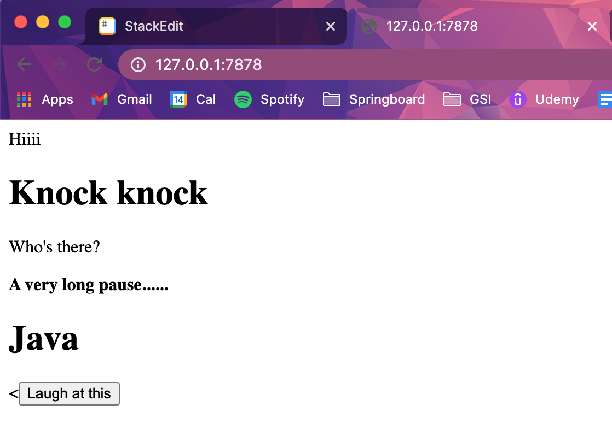
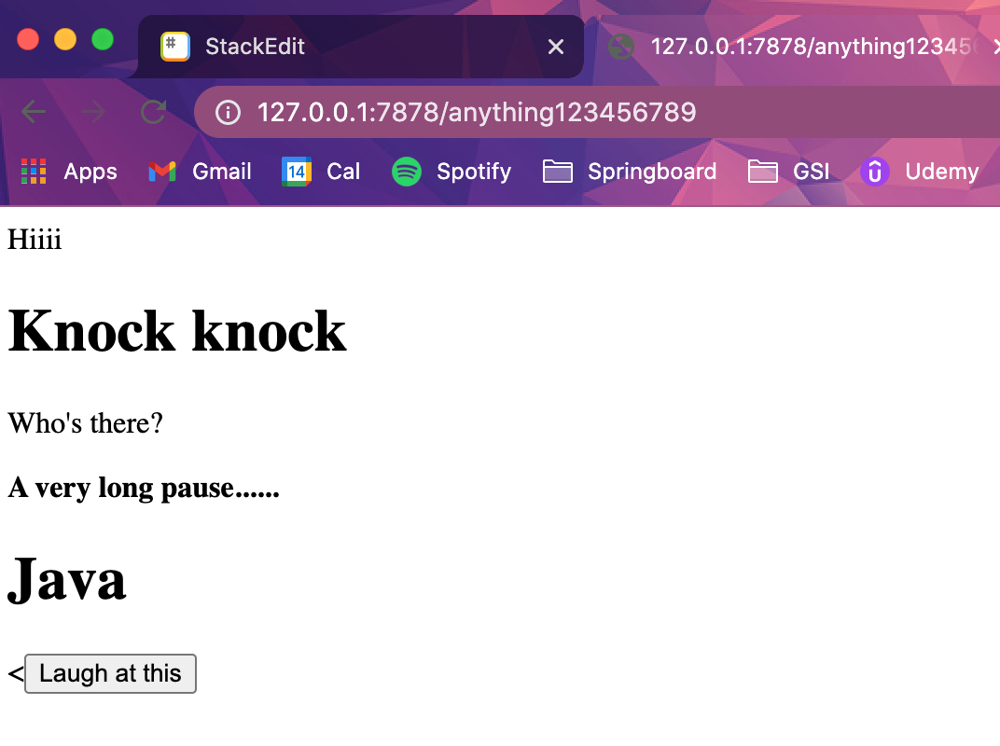
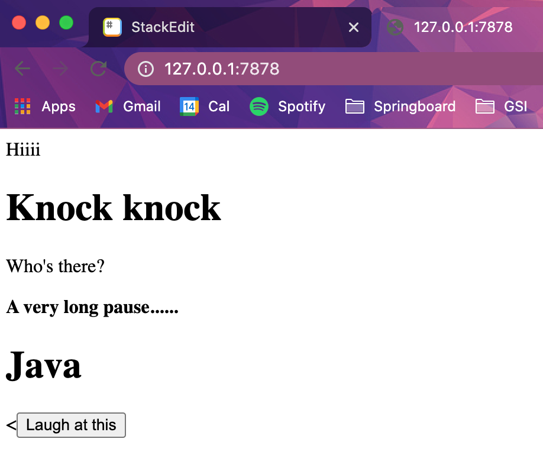
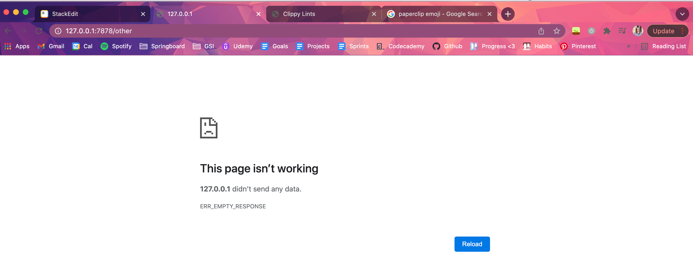
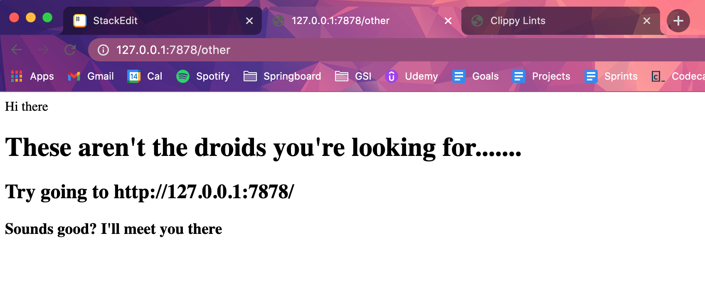
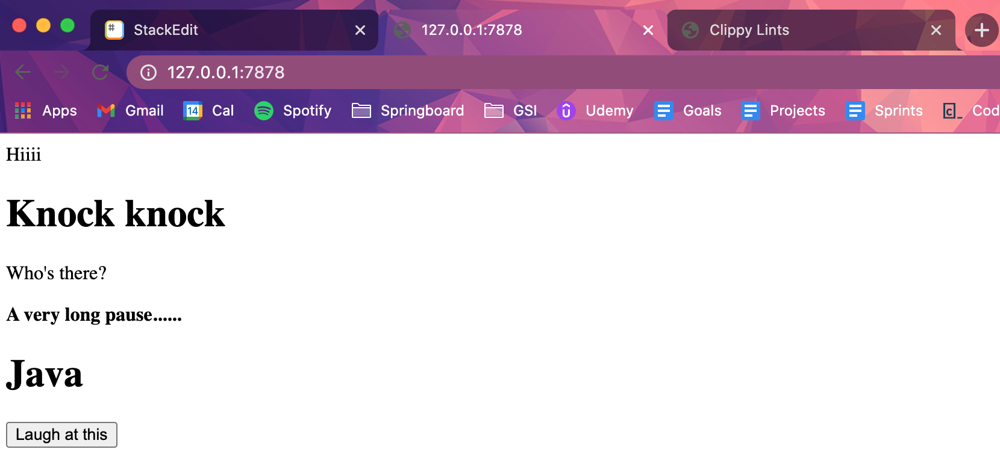

# Multithreaded Web Server
## Final Project in the Rust Book
## Day One — Unit 20.1
https://doc.rust-lang.org/book/ch20-00-final-project-a-web-server.html

This repo is me following the exercise provided by the Rust Book and taking notes. My code in this repo is **heavily commented** .. to get a clearer explanation of what's going on, click the link above :-)

This isn't the optimal approach — this is for learning purposes. Here we'll write the basic HTTP server and thread pool manually. This will help understand what's going on behind the scenes. We'll work with the raw bytes of TCP and HTTP requests and responses.

## Summary
We have a simple web server that responds to one request with a page of content and all other requests with a 404 response.

Currently, our server runs in a single thread, meaning it can only serve one request at a time.

## Questions for Nick
What is `format!`

To confirm, `{}` is for the following positional arguments?
`"HTTP/1.1 200 OK\r\nContent-Length: {}\r\n\r\n{}"`

Why does this `if/else` block result in a scoping issue while the second one doesn't

    /*if buffer.starts_with(home_path_data) {
        status_line = "HTTP/1.1 200 OK";
        filename = "hello.html";
    } else {
        status_line = "HTTP/1.1 404 NOT FOUND";
        filename = "404.html";
    }*/


    let (status_line, filename) = if buffer.starts_with(home_path_data) {
        ("HTTP/1.1 200 OK", "hello.html")
    } else {
        ("HTTP/1.1 404 NOT FOUND", "404.html")
    };


## Getting to know Clippy 📎❤️ [](https://emojipedia.org/red-heart/)

[](https://emojipedia.org/paperclip/)

`cargo clippy`

Clippy let me know that my camelCasing wasn't the thing to do — use snake_casing instead :)


## Build a Single-Threaded Web Server
A summary of protocols involved in building web servers

**HTTP** aka Hypertext Transfer Protocol
**TCP** aka Transmission Control Protocol

Both of these protocols are **request-response** protocols. A **client** initiates a request and a **server** listens for requests and then responds to the client.

**TCP** is the lower-level protocol that describes **how information gets from one server to another**, but doesn't specify what the information is.

**HTTP** builds on top of TCP by **defining the contents of the requests & responses**.

It's technically possible to use HTTP with protocols other than TCP, but it's usually used with TCP.

### Listening to the TCP Connection
Our web server needs to listen to a TCP connection, so let's get started there.

The standard library offers a `std::net` module that lets us do this.

Let's make a new project
`cd Desktop`, `mkdir rust-web-server`, `cd rust-web-server`, `cargo new webserver`, `cd webserver`, open in editor

In `src/main.js`, listen at `127.0.0.1:7878` for incoming TCP streams. When it gets an incoming stream, print `Connection established :D`
```
// Rust Book Multithreaded Web Server Exercise
// Kaitlin Berryman

use std::net::TcpListener;

fn main() {
    // listen at `127.0.0.1:7878` for incoming TCP streams
    // in the address, before the colon is an IP representing the computer & 7878 is the port
    // bind works like the new fn -- it returns a new TcpListener instance (wrapped in a Result)
    // in networking, connecting to a new port is called "binding to a port"
    // use unwrap to stop the program if errors happen
    let listener = TcpListener::bind("127.0.0.1:7878").unwrap();

    // When it gets an incoming stream, print `Connection established :D`
    // The incoming method on TcpListener returns an iterator that gives a stream of TcpStream
    // A single stream is a open connection between a client and server
    // A connection is the name for the full request / response process
    // TcpStream will read from itself to see what the client sent and then allow us to write our response to the stream
    // This for loop will process each stream and produce a series of streams for us to handle
    for stream in listener.incoming() {
        let stream = stream.unwrap();
        println!("Connection established :D")
    }
}

```

**Notes**
- In the address, before the colon is an IP representing the computer & 7878 is the port
- bind works like the new fn -- it returns a new TcpListener instance (wrapped in a Result)
- In networking, connecting to a new port is called "binding to a port"
- Non-admins can only listen on ports greater than 1023, but that's more advanced than this exercise
- Use `unwrap` to stop the program if errors happen
- Many operating systems have a limit to the number of simultaneous open connections they can support

`cargo run` and load `127.0.0.1:7878`
Connection established :D
Connection established :D
Connection established :D ...
is printed in the terminal!

Multiple requests went through

When `stream` goes out of scope, it's dropped

ctrl+c to quit

### Reading the Request
Read the request from your browser!

In `handle_connection` function, read data from the TCP stream and print it, so we can see data being sent from the browser.

Update the code
```
// Rust Book Multithreaded Web Server Exercise
// Kaitlin Berryman

// std::io::prelude lets us read and write to the stream
use std::io::prelude::*;
use std::net::TcpListener;
use std::net::TcpStream;

fn main() {
    // listen at `127.0.0.1:7878` for incoming TCP streams
    // in the address, before the colon is an IP representing the computer & 7878 is the port
    // bind works like the new fn -- it returns a new TcpListener instance (wrapped in a Result)
    // in networking, connecting to a new port is called "binding to a port"
    // use unwrap to stop the program if errors happen
    let listener = TcpListener::bind("127.0.0.1:7878").unwrap();

    // When it gets an incoming stream, call handle_connection and pass stream to it
    // The incoming method on TcpListener returns an iterator that gives a stream of TcpStream
    // A single stream is a open connection between a client and server
    // A connection is the name for the full request / response process
    // TcpStream will read from itself to see what the client sent and then allow us to write our response to the stream
    // This for loop will process each stream and produce a series of streams for us to handle
    for stream in listener.incoming() {
        let stream = stream.unwrap();
        // println!("Connection established :D")

        handle_connection(stream);
    }
}

// stream is mut because TcpStream's internal state may change
fn handle_connection(mut stream: TcpStream) {
    // declare a buffer on the stack 1024 bytes in size
    let mut buffer = [0; 1024];

    // read bytes from TcpStream and put in buffer
    stream.read(&mut buffer).unwrap();

    // convert bytes in buffer to a string and print it
    // String::from_utf8_lossy turns a &[u8] into a String
    // "lossy" indicates that it'll turn invalid UTF-8 with � (the U+FFFD REPLACEMENT CHARACTER)
    println!("Request: {}", String::from_utf8_lossy(&buffer[..]));
}
```

**Notes**
- std::io::prelude lets us read and write to the stream
- now we're printing the request data!
- If repeated connections are all requesting /, our browser is repeatedly not getting a response from our program, so it keeps trying

### A Closer Look at an HTTP Request
Let's break down this request data to understand what the browser is asking of our program

HTTP is a text-based protocol, and a request takes this format

    Method Request-URI HTTP-Version CRLF
    headers CRLF
    message-body

**The First line**
The request line
It holds info about what the client is requesting. The first part is the method of how the client is making the request (like `GET` or `POST`)

Uniform Resource Identifier (URI) ... `/` ... basically a url

HTTP Version the client uses

The  request line ends in `CRLF sequence` aka Carriage Return and Line Feed aka `\r\n` This separates the request line from the request data.

The request changes if we ask from a different address or go to `/somethingelse`

### Writing a Response
Let's send back some data

Responses have the following format
```
HTTP-Version Status-Code Reason-Phrase CRLF
headers CRLF
message-body
```

**The First Line**
The status line

Here's an example of a response using HTTP version 1.1, has a status code of 200, and OK phrase, no headers, no body
`HTTP/1.1 200 OK\r\n\r\n`

Awesome! Understood. Let's write this to the stream as our response.

In `handle_connection`, replace the print statement
```
// Rust Book Multithreaded Web Server Exercise
// Kaitlin Berryman

// std::io::prelude lets us read and write to the stream
use std::io::prelude::*;
use std::net::TcpListener;
use std::net::TcpStream;

fn main() {
    // listen at `127.0.0.1:7878` for incoming TCP streams
    // in the address, before the colon is an IP representing the computer & 7878 is the port
    // bind works like the new fn -- it returns a new TcpListener instance (wrapped in a Result)
    // in networking, connecting to a new port is called "binding to a port"
    // use unwrap to stop the program if errors happen
    let listener = TcpListener::bind("127.0.0.1:7878").unwrap();

    // When it gets an incoming stream, call handle_connection and pass stream to it
    // The incoming method on TcpListener returns an iterator that gives a stream of TcpStream
    // A single stream is a open connection between a client and server
    // A connection is the name for the full request / response process
    // TcpStream will read from itself to see what the client sent and then allow us to write our response to the stream
    // This for loop will process each stream and produce a series of streams for us to handle
    for stream in listener.incoming() {
        let stream = stream.unwrap();
        // println!("Connection established :D")

        handle_connection(stream);
    }
}

// stream is mut because TcpStream's internal state may change
fn handle_connection(mut stream: TcpStream) {
    // declare a buffer on the stack 1024 bytes in size
    let mut buffer = [0; 1024];

    // read bytes from TcpStream and put in buffer
    stream.read(&mut buffer).unwrap();

    // HTTP version 1.1, status code 200, OK phrase, no headers, no body
    let response = "HTTP/1.1 200 OK\r\n\r\n";

    // convert bytes in buffer to a string and print it
    // String::from_utf8_lossy turns a &[u8] into a String
    // "lossy" indicates that it'll turn invalid UTF-8 with � (the U+FFFD REPLACEMENT CHARACTER)
    // println!("Request: {}", String::from_utf8_lossy(&buffer[..]));

    // convert string in resposne to bytes
    // write takes a &[u8] (bytes) and sends bytes to connection
    // &[] is a slice, which is a reference to an array. it handles the length
    // unwrap will stop the program if errors happen
    stream.write(response.as_bytes()).unwrap();

    // flush waits for all bytes to be written to connection
    // unwrap will stop the program if errors happen
    stream.flush().unwrap();
}
```

**Notes**

- TcpStream contains an internal buffer to minimize calls to the underlying OS
- Now when we run it, we don't get an error in the client, just a blank page.

Now we've had an HTTP request ANDDDD a response

🎉[](https://emojipedia.org/party-popper/)🎉[](https://emojipedia.org/party-popper/)🎉[](https://emojipedia.org/party-popper/)🎉[](https://emojipedia.org/party-popper/)🎉[](https://emojipedia.org/party-popper/)🎉[](https://emojipedia.org/party-popper/)🎉[](https://emojipedia.org/party-popper/)🎉[](https://emojipedia.org/party-popper/)🎉[](https://emojipedia.org/party-popper/)🎉[](https://emojipedia.org/party-popper/)🎉[](https://emojipedia.org/party-popper/)🎉[](https://emojipedia.org/party-popper/)🎉[](https://emojipedia.org/party-popper/)🎉[](https://emojipedia.org/party-popper/)🎉[](https://emojipedia.org/party-popper/)

### Returning Real HTML
Just a blank page? We can do more than that!
Create a file called `hello.html` in the root of your project dir (not src!!) You can add any HTML you want -- sounds good! I put a knock knock joke in there — check it out :-)

Now lets' return this from the server when a request is received. Meaning, we need to modify `handle_connection`. Read the HTML file, add it to response body, send
```
// Rust Book Multithreaded Web Server Exercise
// Kaitlin Berryman

// std::io::prelude lets us read and write to the stream
use std::io::prelude::*;

// bring standard library's filesystem module into scope
use std::fs;

use std::net::TcpListener;
use std::net::TcpStream;

fn main() {
    // listen at `127.0.0.1:7878` for incoming TCP streams
    // in the address, before the colon is an IP representing the computer & 7878 is the port
    // bind works like the new fn -- it returns a new TcpListener instance (wrapped in a Result)
    // in networking, connecting to a new port is called "binding to a port"
    // use unwrap to stop the program if errors happen
    let listener = TcpListener::bind("127.0.0.1:7878").unwrap();

    // When it gets an incoming stream, call handle_connection and pass stream to it
    // The incoming method on TcpListener returns an iterator that gives a stream of TcpStream
    // A single stream is a open connection between a client and server
    // A connection is the name for the full request / response process
    // TcpStream will read from itself to see what the client sent and then allow us to write our response to the stream
    // This for loop will process each stream and produce a series of streams for us to handle
    for stream in listener.incoming() {
        let stream = stream.unwrap();
        // println!("Connection established :D")

        handle_connection(stream);
    }
}

// stream is mut because TcpStream's internal state may change
fn handle_connection(mut stream: TcpStream) {
    // declare a buffer on the stack 1024 bytes in size
    let mut buffer = [0; 1024];

    // read bytes from TcpStream and put in buffer
    stream.read(&mut buffer).unwrap();

    // read html file and save it to a string
    // unwrap stops the program if errors happen
    let contents = fs::read_to_string("hello.html").unwrap();

    // HTTP version 1.1, status code 200, OK phrase, no headers, no body
    // let response = "HTTP/1.1 200 OK\r\n\r\n";

    // Add file's contents to the body of response
    // Ensure a HTTP response by adding Content-Length header set to the size of our response body
    // ^^ in this case response body size is the size of hello.html
    let response = format!(
        "HTTP/1.1 200 OK\r\nContent-Length: {}\r\n\r\n{}",
        contents.len(),
        contents
    );

    // convert bytes in buffer to a string and print it
    // String::from_utf8_lossy turns a &[u8] into a String
    // "lossy" indicates that it'll turn invalid UTF-8 with � (the U+FFFD REPLACEMENT CHARACTER)
    // println!("Request: {}", String::from_utf8_lossy(&buffer[..]));

    // convert string in resposne to bytes
    // write takes a &[u8] (bytes) and sends bytes to connection
    // &[] is a slice, which is a reference to an array. it handles the length
    // unwrap will stop the program if errors happen
    stream.write(response.as_bytes()).unwrap();

    // flush waits for all bytes to be written to connection
    // unwrap will stop the program if errors happen
    stream.flush().unwrap();
}

```
**Notes**
- Run it and now we should see our html in the browser rendered
- Currently, we're ignoring the request data in buffer and blindly sending hello.html. Meaning, if we go to `/anything`, we get the same html response ... That's not ideal. We want to customize our responses based on requests.





### Validating the Request and Selectively Responding
Currently, we're returning hello.html no matter what the client requests.

Let's check that the browser is requesting `/` before returning hello.html. Let's also return an error for any other requests `/anythingelse`

Let's check the content of the request against what we expect a request for `/` will look like

Add conditional logic to treat requests differently
```
// Rust Book Multithreaded Web Server Exercise
// Kaitlin Berryman

// std::io::prelude lets us read and write to the stream
use std::io::prelude::*;

// bring standard library's filesystem module into scope
use std::fs;

use std::net::TcpListener;
use std::net::TcpStream;

fn main() {
    // listen at `127.0.0.1:7878` for incoming TCP streams
    // in the address, before the colon is an IP representing the computer & 7878 is the port
    // bind works like the new fn -- it returns a new TcpListener instance (wrapped in a Result)
    // in networking, connecting to a new port is called "binding to a port"
    // use unwrap to stop the program if errors happen
    let listener = TcpListener::bind("127.0.0.1:7878").unwrap();

    // When it gets an incoming stream, call handle_connection and pass stream to it
    // The incoming method on TcpListener returns an iterator that gives a stream of TcpStream
    // A single stream is a open connection between a client and server
    // A connection is the name for the full request / response process
    // TcpStream will read from itself to see what the client sent and then allow us to write our response to the stream
    // This for loop will process each stream and produce a series of streams for us to handle
    for stream in listener.incoming() {
        let stream = stream.unwrap();
        // println!("Connection established :D")

        handle_connection(stream);
    }
}

// stream is mut because TcpStream's internal state may change
fn handle_connection(mut stream: TcpStream) {
    // declare a buffer on the stack 1024 bytes in size
    let mut buffer = [0; 1024];

    // read bytes from TcpStream and put in buffer
    stream.read(&mut buffer).unwrap();

    // hardcode the data coresponding to the / request
    // the b converts the raw bytes we get into a byte string
    let home_path_data = b"GET / HTTP/1.1\r\n";

    // check if buffer starts wuth the bytes in homePathData
    // aka is the request a requst for /
    if buffer.starts_with(home_path_data) {
        // read html file and save it to a string
        // unwrap stops the program if errors happen
        let contents = fs::read_to_string("hello.html").unwrap();

        // Add file's contents to the body of response
        // Ensure a HTTP response by adding Content-Length header set to the size of our response body
        // ^^ in this case response body size is the size of hello.html
        let response = format!(
            "HTTP/1.1 200 OK\r\nContent-Length: {}\r\n\r\n{}",
            contents.len(),
            contents
        );

        // convert string in resposne to bytes
        // write takes a &[u8] (bytes) and sends bytes to connection
        // &[] is a slice, which is a reference to an array. it handles the length
        // unwrap will stop the program if errors happen
        stream.write(response.as_bytes()).unwrap();

        // flush waits for all bytes to be written to connection
        // unwrap will stop the program if errors happen
        stream.flush().unwrap();
    } else {
        // it's some other request
    }
}
```

**Notes**
Because we're reading raw bytes into the buffer, transfer form those raw bytes into a byte string by adding `b""` at the start of the content data
`let homePathData = b"GET / HTTP/1.1\r\n";`

Now we only get our HTML when on `/`, not any other url



-----

Now let's fill in the else block to return a response with the status code 404, which means that the content for the request wasn't found. We'll also return some HTML for a page to render this to the user.

```
// Rust Book Multithreaded Web Server Exercise
// Kaitlin Berryman

// std::io::prelude lets us read and write to the stream
use std::io::prelude::*;

// bring standard library's filesystem module into scope
use std::fs;

use std::net::TcpListener;
use std::net::TcpStream;

fn main() {
    // listen at `127.0.0.1:7878` for incoming TCP streams
    // in the address, before the colon is an IP representing the computer & 7878 is the port
    // bind works like the new fn -- it returns a new TcpListener instance (wrapped in a Result)
    // in networking, connecting to a new port is called "binding to a port"
    // use unwrap to stop the program if errors happen
    let listener = TcpListener::bind("127.0.0.1:7878").unwrap();

    // When it gets an incoming stream, call handle_connection and pass stream to it
    // The incoming method on TcpListener returns an iterator that gives a stream of TcpStream
    // A single stream is a open connection between a client and server
    // A connection is the name for the full request / response process
    // TcpStream will read from itself to see what the client sent and then allow us to write our response to the stream
    // This for loop will process each stream and produce a series of streams for us to handle
    for stream in listener.incoming() {
        let stream = stream.unwrap();
        // println!("Connection established :D")

        handle_connection(stream);
    }
}

// stream is mut because TcpStream's internal state may change
fn handle_connection(mut stream: TcpStream) {
    // declare a buffer on the stack 1024 bytes in size
    let mut buffer = [0; 1024];

    // read bytes from TcpStream and put in buffer
    stream.read(&mut buffer).unwrap();

    // hardcode the data coresponding to the / request
    // the b converts the raw bytes we get into a byte string
    let home_path_data = b"GET / HTTP/1.1\r\n";

    // check if buffer starts wuth the bytes in homePathData
    // aka is the request a requst for /
    if buffer.starts_with(home_path_data) {
        // read html file and save it to a string
        // unwrap stops the program if errors happen
        let contents = fs::read_to_string("hello.html").unwrap();

        // Add file's contents to the body of response
        // Ensure a HTTP response by adding Content-Length header set to the size of our response body
        // ^^ in this case response body size is the size of hello.html
        let response = format!(
            "HTTP/1.1 200 OK\r\nContent-Length: {}\r\n\r\n{}",
            contents.len(),
            contents
        );

        // convert string in resposne to bytes
        // write takes a &[u8] (bytes) and sends bytes to connection
        // &[] is a slice, which is a reference to an array. it handles the length
        // unwrap will stop the program if errors happen
        stream.write(response.as_bytes()).unwrap();

        // flush waits for all bytes to be written to connection
        // unwrap will stop the program if errors happen
        stream.flush().unwrap();
    } else {
        // it's a request other than /
        let status_line = "HTTP/1.1 404 NOT FOUND";

        // read html file and save it to a string using filesystem
        // unwrap stops the program if errors happen
        let contents = fs::read_to_string("404.html").unwrap();

        // Add file's contents to the body of response
        let response = format!(
            "{}\r\nContent-Length: {}\r\n\r\n{}",
            status_line,
            contents.len(),
            contents
        );

        // convert string in resposne to bytes
        // write takes a &[u8] (bytes) and sends bytes to connection
        // &[] is a slice, which is a reference to an array. it handles the length
        // unwrap will stop the program if errors happen
        stream.write(response.as_bytes()).unwrap();

        // flush waits for all bytes to be written to connection
        // unwrap will stop the program if errors happen
        stream.flush().unwrap();
    }
}

```

and create `404.html`

**Notes**
Now 127.0.0.1:7878/ returns hello.html and all other pages return 404.html




### A Touch of Refactoring
The if / else blocks have lots of repetition. The only differences are the status codes and the filename. Let's clean this up

```
```

**Notes**
    /*if buffer.starts_with(home_path_data) {
        status_line = "HTTP/1.1 200 OK";
        filename = "hello.html";
    } else {
        status_line = "HTTP/1.1 404 NOT FOUND";
        filename = "404.html";
    }*/

    let (status_line, filename) = if buffer.starts_with(home_path_data) {
        ("HTTP/1.1 200 OK", "hello.html")
    } else {
        ("HTTP/1.1 404 NOT FOUND", "404.html")
    };

The first if/else block results in a scoping error
The second one is correct

In the correct if/else block, the status_line and filename are returned in a tuple. Then, we use destructuring to assign them. See **Chapter 18** to see this destructuring using a `let` statement

-------

Yay!!!! Now we have a simple web server that responds to one request with a page of content and all other requests with a 404 response.

Currently, our server runs in a single thread, meaning it can only serve one request at a time.

Next we'll show how that's a problem by simulating some slow requests. After that, we'll fix it so that our server can handle multiple requests at once.
